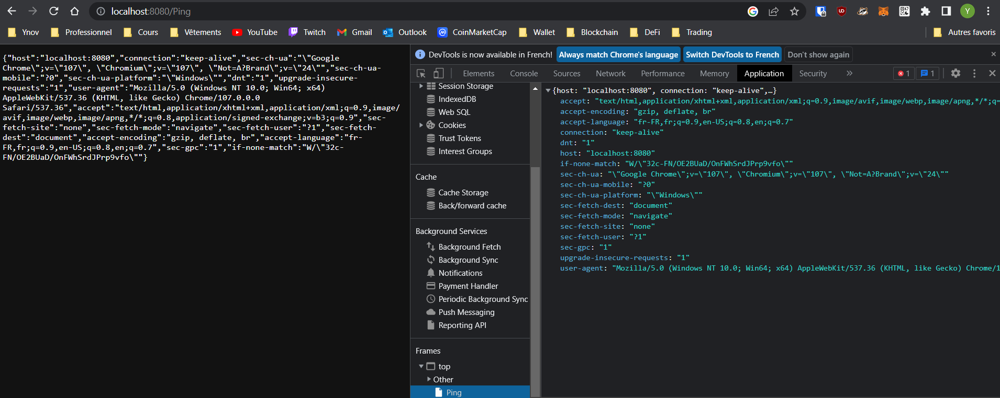
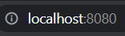

# DevOps

## Mettre en place l'environnement de développement et les bases du projet avec le moins de dépendances possibles
On initialise le projet et on ajoute la dépendance et le paquet express
```
npm init -y
npm install typescript ts-node @types/node @types/express --save-dev
npm install express
npx tsc --init --rootDir src --outDir build --esModuleInterop --resolveJsonModule --lib es6 --module commonjs --allowJs true --noImplicitAny true
mkdir src   // Dossier SRC qui contiendra nos fichiers .ts
```
Voici l'architecture du projet une fois les paquets installés et le fichier index.ts créé.


## Développer une API qui retourne au format JSON les headers de la requête quand il y une requête HTTP GET sur /ping
Quand on se rend sur `localhost:8080/ping`, cela récupère les headers et les envoie en réponse de la requête, ce qui les ajoute dans Application/Json
```
app.get('/ping', (req, res) => {
    res.send(req.headers);
})
```


## Le serveur doit écouter sur un port configurable via la variable d'environnement : PING_LISTEN_PORT ou par défaut sur un port au choix
Ici, j'ai créé une variable ``PING_LISTEN_PORT`` dont la valeur est modifiable (INT), qui permet de changer le port sur lequel le serveur écoute.
```
const PING_LISTEN_PORT = 8080;

app.listen(PING_LISTEN_PORT, () => {
    console.log('The application is listening on port ' + PING_LISTEN_PORT + ' !');
})
```
Ici, le port que j'ai défini par défaut est `8080`, on doit donc se rendre sur ``localhost:8080`` pour accéder au serveur.


## Réponse vide avec code 404 si quoi que ça soit d'autre que GET /ping
Sur toutes les pages que l'on n'a pas définit, la réponse de la requête renvoie l'erreur 404.
```
app.all('*', (req, res) => {
  res.status(404).send();
});
```


## Exécution du serveur web
Ces deux commandes sont à lancer dans le terminal et permettent de build le projet, puis de lancer le serveur.
```
npx tsc             // Build le programme, génère le index.js
node build/index.js // Permet de lancer le serveur
```
On se rend ensuite sur localhost:8080 pour accéder au serveur web.

Localhost:8080/Ping pour tester les pings et vérifier dans application/Json qu'il y'a bien les headers. 