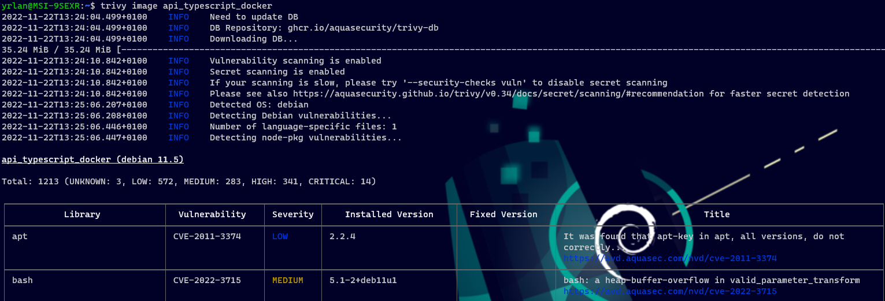

# WIK-DPS-TP02 | MONTAGNIER Yrlan

## Créer une image Docker avec un seul stage qui permet d’exécuter votre API développée précédemment (WIK-DPS-TP01)
[dockerfile](dockerfile)
```
FROM node as builder

WORKDIR /usr/src/app

COPY package*.json ./

RUN npm install

COPY . .

RUN npx tsc

CMD node build/index.js

USER node
```

## L'image doit être la plus optimisée possible concernant l'ordre des layers afin de limiter le temps de build lors des modifications sur le code
Le build de l'image docker à partir du dockerfile se fait via la commande `docker build -t api_typescript_docker .`, il prend environ ~10s à se faire.
    

Pour le deuxième dockerfile, stage d'éxecution et de build séparés, ce qui rend l'image beaucoup plus rapide à build.
    
## Scanner votre image avec docker scan, trivy ou clair pour obtenir la liste des vulnérabilités détectées
Pour scanner mon image, j'ai utilisé trivy avec la commande trivy image `api_typescript_docker`.
    

## L'image doit utiliser un utilisateur spécifique pour l'exécution de votre serveur web
Dans le dockerfile, j'ai rajouté `USER node` à la fin du fichier, qui est intégré à l'image de node et permet de lancer le conteneur avec cet utilisateur `node`.
Cela se passe donc pendant le build de l'image.

Cette commande permet de retourner l'utilisateur sur lequel sont lancés les différents conteneurs en cours :
```
yrlan@MSI-9SEXR:~$ docker inspect $(docker ps -q) --format '{{.Config.User}} {{.Name}}'
node /API_TypeScript_Yrlan
```
On voit que notre conteneur (API_TypeScript_Yrlan) est bien lancé via l'utilisateur `node`

## Créer une seconde image Docker pour votre API avec les mêmes contraintes en termes d'optimisations mais avec plusieurs stages : un pour l'étape de build et une autre pour l’exécution (qui ne contient pas les sources)
```
## Stage 1 - Build
FROM node as builder
WORKDIR /usr/src/app
COPY ["package.json", "package-lock.json", "./"]
RUN ["npm", "install"]
COPY . .
RUN ["npx", "tsc"]

## Stage 2 - Exécution du serveur
FROM builder as executer
WORKDIR /usr/src/app
ENTRYPOINT ["node", "./build/index"]
USER node
```
Ici, le stage de build et d'éxécution sont séparés, j'ai aussi utilisé la syntaxe d'éxecution pour les commandes et l'entrypoint pour le lancement du serveur.
```
docker exec API_TypeScript_Yrlan ps -eo pid,ppid,user,args --sort pid
  PID  PPID USER     COMMAND
    1     0 node     node ./build/index
   13     0 node     ps -eo pid,ppid,user,args --sort pid
```
On voit qu'il n'y plus qu'un process actif sur le conteneur docker qui est l'éxécution du serveur.
## Pour lancer le projet :
1. Cloner le repo avec `git clone https://github.com/yrlan-montagnier/WIK-DPS-TP02.git`
2. Ouvrir le dossier dans vscode ou dans un terminal et éxecutez ces commandes :
    -   ```
        ## Pour lancer le build avec le dockerfile d'origine
        docker build -t api_typescript_docker .

        ## Pour lancer le build avec le dockerfile multi-stage (plus rapide)
        docker build -t api_typescript_docker -f .\dockerfile2 .
        ```
    - Pour lancer le conteneur docker à partir de l'image que l'on vient de build :

        `docker run -d -p 8080:8080 --name API_TypeScript_Yrlan api_typescript_docker`
